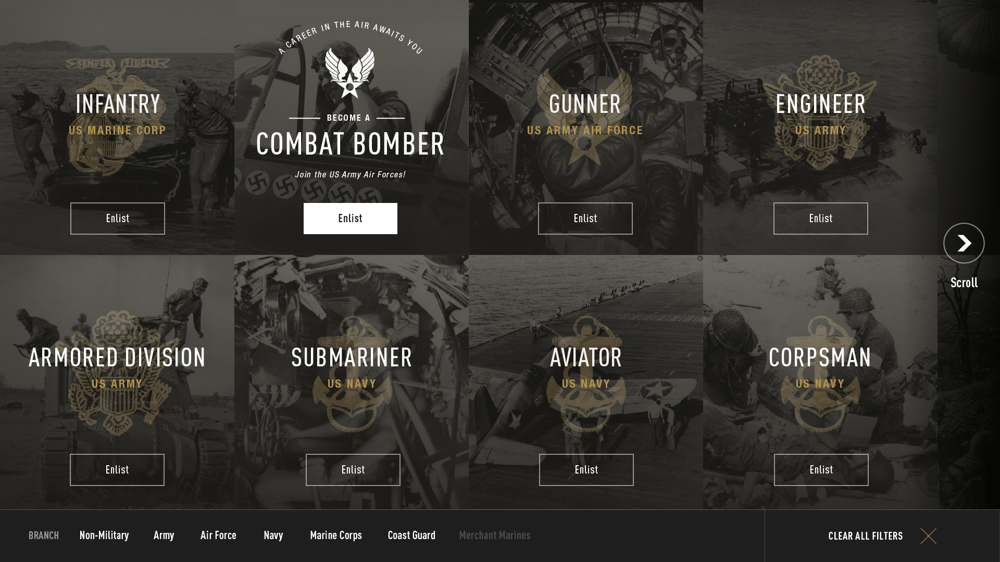
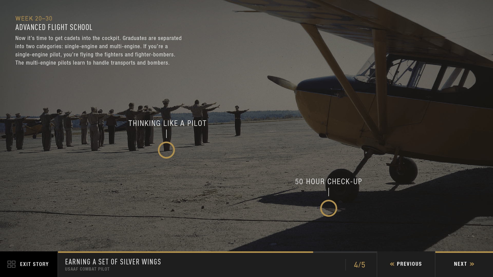

# Developing Interactive Kiosks 
## Powered by Drupal and JS

---

# Williamson Vedder :whale2:
###Developer @ Bluecadet
###Sometimes Adjunct @ Drexel, Temple

^So who am I?

^Bluecadet is an Emmy Award-winning digital agency that creates world-class websites, mobile apps, interactive installations, and immersive environments.

---
#Agenda 🗒

 - Cool kiosk examples 
 - Drupal's role in kiosks
 - Decoupled overview
 - High-level kiosk architecture
 - Brief D8 api walkthroughs (simple, advanced )
 - Frontend Implementation (JS)

---

#🤔

^Who here has produced an interactive kiosk?

^...with success?

---

#Kiosk

A computer terminal featuring specialized hardware and software that provides access to information and content.

 - Touch capable 👆
 - Large displays
 - Optional sensors and peripherals (RFID, proximity sensor, printer)
 - Driving immersive experiences

---

#Bluecadet Kiosk History

 - Early on, built kiosks in Flash ⚰
 - Transitioned to C++ (w/ Cinder)
 - Strong frontend web devs (esp frontend)
 - Began developing w/ web tech (HTML,CSS,JS)
 - Healthy mix between web tech and non-web tech

---

^Specialized training

--- 

^Digital weapons

^"The curators wanted people to have up-close detail look at delicate, priceless objects"

^Enough with the examples, dive right into the backend implementation

---

#Why use a CMS?

 - Clients still have lots of content
 - Devs don't want to make frequent content updates
 - Clients are likely familiar with Drupal, Wordpress, etc
 - Can be an all-in-one platform simultaneously serving many products
 - Possibly keep private from clients (dev only) 😯f.

^ Originally we just wanted to normalize data 

^ Reduce errors

---

#Why use Drupal?

 - Built-in JSON api support (D8 only)
 - Serve a kiosk adjacent to an existing Drupal site
 - You're skilled in Drupal
 - Node structure, node refs easy to understand and apply to some kiosk applications
 - Backed by non-profits, govt agencies 
 - Other CMS's can handle this too 🤐

^Touch on JSON API support in the next few slides

^Other CMSes can handle the responsibility of content management and acting as a RESTful API. Our team just prefers Drupal

---

#Drupal in Kiosk Development

Drupal serves two roles:

 - Managing content 
 - Delivering machine-consumable JSON via api

Known as Decoupled Drupal

^Quick slide

^The first point is the bread and butter of drupal

^Before we dive too deep, I want to take a second to review decoupled drupal

---

#Headless/Decoupled Drupal

Hard separation between theming layer and rest of CMS. Drupal feed raw data to a front-end framework like React or Angular.

^Who here has seen me speak before?

^Quick definition

^Drupal sends mostly raw data

^Front-end framework consumes data and generates html

^Headless = decoupled

---

#Traditional (coupled)

No hard separation. Drupal handles data processing and theming. 

Think: most Drupal sites now. Business as usual.

^For the sake of comparison

---

#Fully Decoupled

Full separation between data layer and front-end layer. Drupal sends data via JSON to a JS framework (React, Angluar, Vue, etc.)

^Personally I prefer React for it's state management abilities but any JS framework will work really

^I'm not going to get up here and tell you what frameworks to use

---

#Fully decoupled pros :thumbsup:

- Snappy interactions via client side rendering 

- Fully customizable interfaces/markup 

- Easily swappable front-end/back-end

- Good usage of existing skills (maybe?)

---

#Decoupled Drupal: Bottom Line

The advent of Decoupled Drupal has allowed us to apply our talents to newer, more dynamic platforms with relative ease, especially kiosks

^Rich Web Applications with ReactJS and Drupal 8 by Jitesh Doshi today @ 1pm

---

#Common Architecture Constraints

 - Internet access? (often none)
 - Local network? (sometimes...)
 - Quantity (ranges 1->100+)?
 - Remote access?
 - Centralized server?
 - Physical access?

---

#Example Architecture (Simple)

---

#Example Architecture (Intermediate)

 - Constraint: no internet connection 

---

#Example Architecture (Advanced)

 

--- 

#D8 API Walkthrough (Simple)

- Easy site-building
- Enable an included module
- Create a view
- Consume your api

---

#D8 Walkthrough: First steps

- Clean install
- Created "Song" content type:
    - Artist
    - Embed code
    - Mood :smirk:

Objective: make a music API

---

#D8 Walkthrough: create your api

---

#D8 Walkthrough: enable RestFul Web Services module

---

#D8 Walkthrough: create a view

---

#D8 Walkthrough: check out your amazing api

--- 

#D8 API Walkthrough (Advanced)

- Create a custom module
- Register API controller
- Register path to controller
- Execute custom query
- Conform returned data
- Return JSON response

---

#Demo: Create API Controller

^ Bonus points: spot my syntax error...

---

#Frontend

^ Transitioning away from the backend

^ Moving into the frontend

---

#Why web tech for kiosks? (frontend)

- Browser is a full rendering engine
- Chrome V8 very powerful 💪
- Reappropriation of skills easy from web to kiosks
- Relative easy porting to web if needed

^Existing knowledge of HTML, CSS, JS and general web development would transfer over almost exactly to this new area of development. 

^Really when we say the browser we mean Chrome, it is currently the most stable and fully-featured web browser, especially in terms of executing javascript and interpreting wacky, bleeding-edge CSS

---

#Why a JS-framework frontend?

- Snappy interactions via client side rendering 🔥

- Fully customizable interfaces/markup 

- Manage complex state and visual transitions

- Good usage of existing skills (maybe?)

^Revisiting the pros of a decoupled environment

^Managing state especially a challenge especially for very complex/abstract kiosk applications

---

^ Want to take a minute and prove that this i

^ I'm hoping this demystifies the development

--- 

#Runtime/Deployment Challenges

- Preventing users from exiting application
- Hiding browser chrome
- Hiding windows default touch accessibility features
- Hiding cursor
- Memory leaks 💣

Running chrome w/ flags `--kiosk --disable-pinch --overscroll-history-navigation=0`

---

#Development nuances

- Javascript events are different (ex: onTouchStart vs onMouseDown)

- ...

- ...

- ?

^Non-responsive styles 

---

#Design nuances

- Different gestures, horiz. swipe vs vert. swipe

- One specific form factor 

- Bigger hit-states

- Ergonomics, consider arm reach

^ Low DPI screens

---

---

---

#Testing

- Memory management/soak-testing
	- Run overnight/weekend
	- Chrome memory dev tools
	- Unbinding events, cancelling animations and timers etc.
- Monkey-testing 🙊
	- Automated w/ gremlins.js
	- Manually banging fists 👊

---

---

#When web tech is inappropriate

- GPU-intensive (many pixels, 4k videos)

- Complex gestures ( Multi-user 👯, )

- Abstract or gamified architecture

- Certain sensors and peripherals (proximity,printers)

…
Look to build with Unity, Cinder (both can be coupled with Drupal). 

^Litmus test: multiple users, sensors

^NWWII RFID w/ node server

---

^Non-web tech kiosks example 2

---

^Non-web tech kiosks example 1

---

---

#Bringing it back 

^ While those are cool, I don't want to give the impression that they're any less impressive

^ Clients are happy, internally we're happy 

---

#With that said

 - Web tech approach:
  - Quicker ($$$)
  - Easier to field a team
  - Yields high quality products
  - Is approaching feature parity (WebGL, WebAssembly)

^ Perhaps this is just a temporary limit of talent and creativity w/ WebGL and other cool JS-graphics-things 

---

#Takeaways  :sunglasses:

 - 

^ Inspired some creativity

----

#Presentation/demo files

###[https://github.com/willvedd/govcon17-kiosk](https://github.com/willvedd/govcon17-kiosk)