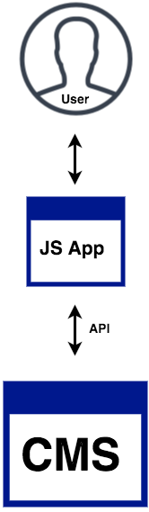

# Developing Interactive Kiosks 
## Powered by Drupal and JS

---

# Williamson Vedder :whale2:
###Developer @ Bluecadet
###Someimtes Adjunct @ Drexel, Temple

^So who am I?

^Bluecadet is an Emmy Award-winning digital agency that creates world-class websites, mobile apps, interactive installations, and immersive environments.

---
#Agenda

 - Cool kiosk examples
 - Decoupled Drupal overview
 - Drupal's role in kiosks
 - Brief D8 api walkthroughs (simple, advanced )
 - Frontend Implementation (JS)

---

#🤔

^Who here has produced an interactive kiosk?

^...with success?

---

#Kiosk

A computer terminal featuring specialized hardware and software that provides access to information and content.

---

^Kiosk example 1

---

^Kiosk example 2

---

^Kiosk example 3

--- 

^Kiosk example 4

---

#Headless/Decoupled Drupal

Hard separation between theming layer and rest of CMS. Drupal feed raw data to a front-end framework like React or Angular.

^Before we dive into 

^Quick definition

^Drupal sends mostly raw data

^Front-end framework consumes data and generates html

^Headless = decoupled

---

#Traditional (coupled)

No hard separation. Drupal handles data processing and theming. 

Think: most Drupal sites now. Business as usual.

^For the sake of comparison

---

#Fully Decoupled

Full separation between data layer and front-end layer. 

---

#Decoupled Drupal: Bottom Line

The advent of Decoupled Drupal has allowed us to apply our talents to newer, more dynamic platforms with relative ease.

---

#Where Drupal Fits In

Drupal serves two roles, content management system and delivering machine-consumable JSON via an api.

---

#Common Architecture Constraints

 - Internet access? (often none)
 - Local network? (sometimes...)
 - Quantity (ranges 1->100+)?
 - Remote access?
 - Centralized server?
 - Physical access?

---

#Example Architecture (Simple)

---

#Example Architecture (Intermediate)

 - Constraint: no internet connection 

---

#Example Architecture (Advanced)

 

---

#Why use a CMS?

 - Clients still have lots of content
 - Devs don't want to make frequent content updates
 - Clients are likely familar with Drupal, Wordpress, etc
 - Can be an all-in-one platform simultaneously serving many products

---

#Why use Drupal?

 - Built-in JSON api support (D8 only)
 - Serve a kiosk adjacent to an exisiting Drupal site
 - You're skilled in Drupal
 - Node structure and referencing easy to grok and apply to kiosk applications
 - Other CMS's can handle this too (shhh)

^Other CMSes can handle the responsibility of content manangement and acting as a RESTful API. Our team just prefers Drupal

--- 

#D8 API Walkthrough (Simple)

- Easy site-building
- Enable an included module
- Create a view
- Consume your api

---

#Demo: create your api

^Working backwards from the data model 

---

#D8 Walkthrough: enable RestFul Web Services module

---

#D8 Walkthrough: create a view

---

#Demo: check out your amazing api

--- 

#D8 API Walkthrough (Advanced)

- Create a custom module
- Register API controller
- Register path to controller
- Execute custom query
- Conform returned data
- Return JSON response

---

#Demo: Create Custom Module

---

#Demo: Register path to controller

---

#Demo: Register path to controller

---

#Demo: Resulting file structure

---

#Demo: Create API Controller

---

#Why web tech for kiosks? (frontend)

- Browser is a full rendering engine
- Reappropriation of skills easy from web to kiosks
- Relative easy porting to web

^Existing knowledge of HTML, CSS, JS and general web development would transfer over almost exactly to this new area of development. 

--- 

#Running in Chrome Challenges

- Preventing users from exiting application
- Hiding browser chrome
- Hiding windows default touch accessibility features
- Hiding cursor
- Running with flags (kiosk flag etc)
- Memory leaks

---

#Why a JS-framework frontend?

 - No page reloads and very responsive. (reword)
 - Large library of other modules to choose from to integrate. (reword)
 - Potentially take the same concepts in ReactJS and move it to React Native if a mobile app is needed.  (reword)

---

# Common Development nuances

- Javascript events are different (onTouchStart vs onMouseDown)
- 

---

#Testing

- Memory management/soak-testing
- Monkey-testing
	- Automated w/ gremlins.js
	- Manually via banging fists

---

#When web tech is inappropriate

- GPU-intensive 

- Complex gestures

- Abstract or gamified architecture

- Look to build with Unity, Cinder (both can be coupled with Drupal)

Perhaps this is just a temporary limit of talent and creativity w/ WebGL and other cool JS-graphics-things 

---

^Non-web tech kiosks example 1

---

^Non-web tech kiosks example 2

---

#Takeaways  :sunglasses:

When kiosks are app-like... 

^

----

#Presentation/demo files

###[https://github.com/willvedd/govcon17-kiosk](https://github.com/willvedd/govcon17-kiosk)